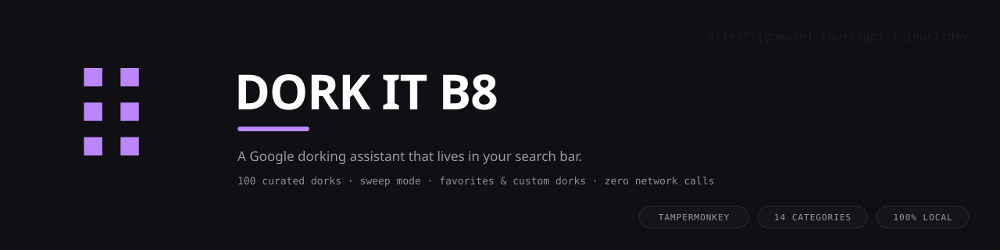
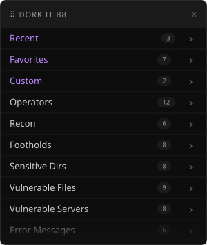
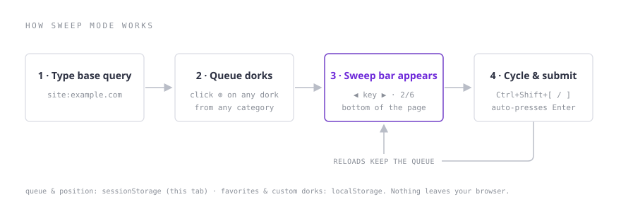
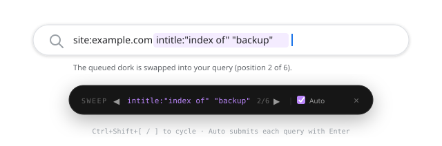

# Dork it B8

A Tampermonkey userscript that turns Google's search box into a dorking console. It watches the search bar, suggests from 100 curated dorks in 14 categories as you type, and inserts them at the cursor with the spacing handled. It also adds sweep mode, which runs a queue of dorks against one base query without retyping any of it.

> **Authorized use only.** Dorking is OSINT: it queries Google's public index and nothing else. Use it on assets you own or are authorized to test, such as bug bounty scopes, your own servers, security assessments, or CTF practice. Do not use it against systems you have no permission to touch.

## What it does

- **Filter as you type:** start typing any operator and the menu opens beside the search box, narrowing all 100 dorks by key, description, or category name.
- **Insert at the cursor:** a click or Enter replaces the word at your cursor with the full dork. Spacing around it is handled.
- **Domain templates:** recon dorks like `site:*.[domain] inurl:api` prompt for a domain and build the final query for you.
- **Favorites, recents, customs:** star the dorks you actually use. The last 10 inserts stay under Recent. Custom saves your own dorks with descriptions.
- **Sweep mode:** queue any number of dorks, then cycle through them with two keys while Google submits each query. See [Sweep mode](#sweep-mode).
- **Low profile:** one ⠿ button on the search box and a dark menu that leaves the page alone.

## Install

1. Install [Tampermonkey](https://www.tampermonkey.net/) (Chrome, Edge) or [Violentmonkey](https://violentmonkey.github.io/) (Firefox).
2. Install the script:
   - **Greasy Fork:** https://greasyfork.org/en/scripts/dork-it-b8 <!-- TODO: replace with the real listing URL after upload -->
   - **Directly from this repo:** [dork-it-b8.user.js](https://github.com/Bil8l/dork-it-b8/raw/main/dork-it-b8.user.js)
3. Open Google. The ⠿ button appears at the right edge of the search box.

Works on any Google country domain (`google.de`, `google.co.in`, and so on) under Tampermonkey, which understands the `.tld` match pattern.

## Keyboard

| Keys | Action |
|---|---|
| `Ctrl+Shift+H` | show or hide the menu |
| *(just type)* | live-filter all 100 dorks |
| `Tab` | jump from the search box into the menu |
| `↑` / `↓` | move through rows |
| `Enter` | insert the selected dork |
| `Esc` | back one level, or close |
| `Ctrl+Shift+]` / `Ctrl+Shift+[` | sweep: next or previous dork |

## Sweep mode

Run many dorks against one base query without retyping any of it:

1. Type the base query, for example `site:example.com ` with a trailing space.
2. Click ⊕ on every dork you want to run. A queue bar appears at the bottom of the page.
3. Press `Ctrl+Shift+]`. The next dork replaces the last one and Google submits.
4. Keep pressing. One query per dork, results one page at a time.

The queue and its position survive Google's page navigations within the tab (they ride in `sessionStorage`), so the bar is still there when the results page loads. Toggle **Auto** off in the bar if you want to swap dorks without submitting.

## The dork library

| Category | Surfaces | Dorks |
|---|---|---:|
| Operators | the building blocks: `site:`, `inurl:`, `filetype:` and more | 12 |
| Recon | subdomains, signup, API and dev endpoints of a target domain | 6 |
| Footholds | exposed admin panels (WordPress, phpMyAdmin, Joomla and others) | 8 |
| Sensitive Dirs | open indexes: `.git`, `.env`, `.ssh`, backups, logs | 8 |
| Vulnerable Files | dumps and configs that leak secrets | 9 |
| Vulnerable Servers | phpinfo, Tomcat manager, Grafana, Jenkins, Kibana | 8 |
| Error Messages | stack traces and database errors that reveal structure | 6 |
| Juicy Info | credential spreadsheets, confidential PDFs, user enumerators | 7 |
| Passwords | files that should not have passwords in them | 6 |
| Usernames | user lists and directory exports | 4 |
| Login Portals | VPN, webmail, cPanel and admin gateways | 8 |
| Server Detection | default pages that fingerprint the stack | 5 |
| Network / Vuln | routers, firewalls, dashboards, exposed data stores | 7 |
| Online Devices | IP cameras and streaming endpoints | 6 |

All of it is standard GHDB-style public knowledge. What the script adds is having it one keystroke away.

## Privacy

The script makes no network requests of its own. It only reads and writes the Google page you are already on. Favorites, recents and custom dorks live in `localStorage` under the `db8.` prefix. Sweep state lives in `sessionStorage` for the current tab. Uninstalling the script or clearing site data wipes everything.

## Contributing

Found a dork that earns its place, or one that stopped working? Open an issue or a pull request against `DORK_DB` at the top of `dork-it-b8.user.js`. One key, one description, a sensible category.

## License

[MIT](LICENSE)
